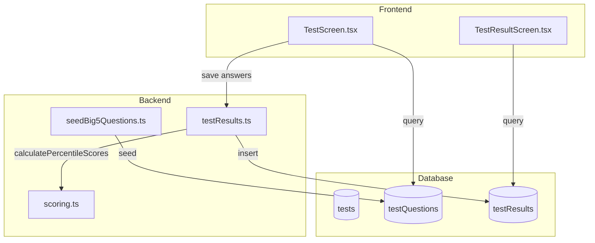
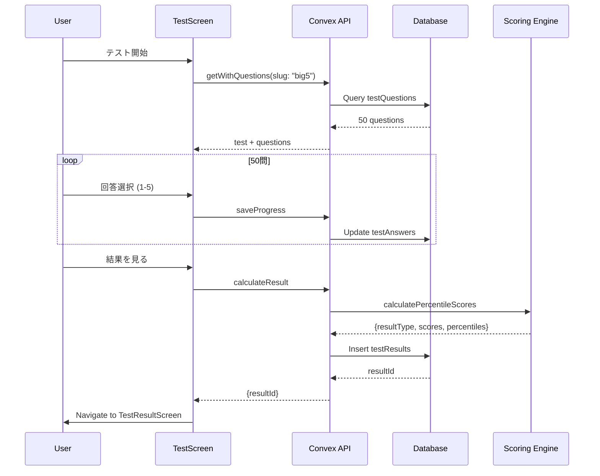
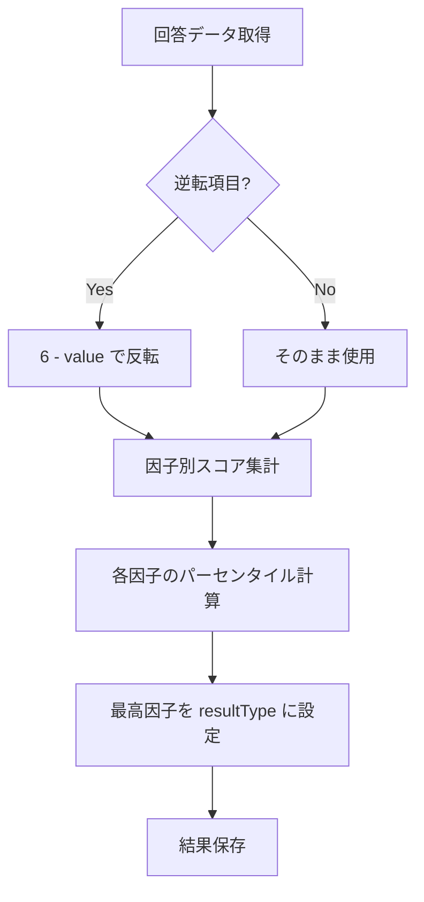

# Technical Design Document: BIG5-IPIP-50

## Overview

**Purpose**: BIG5診断（IPIP-50）は、Costa & McCraeの5因子モデルに基づく科学的に検証された性格診断機能を提供する。International Personality Item Pool（IPIP）の50項目版を使用し、ユーザーの性格基盤を包括的に測定する。

**Users**: 自己理解を深めたいPernectユーザーが、科学的根拠に基づいた性格診断を通じて、自身のOCEAN（開放性・誠実性・外向性・協調性・神経症傾向）プロファイルを把握する。

**Impact**: 既存の`evidence-based-diagnostics`フレームワークを拡張し、BIG5テスト定義に対応する50問の質問データを追加する。

### Goals

- IPIP-NEO-50項目を完全に実装し、日本語ローカライズを提供
- 5段階リッカートスケール（1-5）による回答システム
- 逆転項目（21問）の正確なスコアリング処理
- 各因子のパーセンタイルスコア計算
- 既存の`TestScreen`・`TestResultScreen`コンポーネントとのシームレスな統合

### Non-Goals

- カスタムUI/UXの新規開発（既存コンポーネントを再利用）
- ノルムデータベースの構築（統計的パーセンタイル計算は将来の拡張）
- ファセット（下位因子）レベルの詳細分析
- 他言語対応（日本語のみ）

## Architecture

### Existing Architecture Analysis

現在のシステムは以下の構造を持つ：

1. **テスト定義**: `convex/seedEvidenceBasedTests.ts`に`BIG5_TEST`が定義済み
2. **スコアリング**: `convex/scoring.ts`の`calculatePercentileScores()`関数がパーセンタイル計算を担当
3. **質問管理**: `testQuestions`テーブルで質問データを管理
4. **UI**: `TestScreen.tsx`がリッカートスケール質問に対応

### High-Level Architecture



**Architecture Integration**:
- 既存パターン保持: Convex mutation/query、リアクティブUI更新
- 新規コンポーネント: `seedBig5Questions.ts`（質問データシード）のみ
- 技術整合性: TypeScript、Convex、React Native
- Steering準拠: evidence-based-diagnostics設計原則に従う

### Technology Stack and Design Decisions

**Technology Alignment**:
- Convex BaaS: 既存のテーブル構造（`testQuestions`）を活用
- TypeScript: 型安全な質問データ定義
- 既存scoringエンジン: `percentile`タイプのスコアリング処理

**Key Design Decisions**:

#### Decision 1: 質問データ構造

- **Decision**: `likert`タイプの質問として実装し、`scoreKey`に因子コード（O, C, E, A, N）を使用
- **Context**: IPIP-50は5段階リッカートスケールで回答する形式
- **Alternatives**:
  - `multiple`タイプで5つの選択肢を明示
  - カスタム質問タイプの新規作成
- **Selected Approach**: `likert`タイプを使用し、`typeConfig.likertMin=1`, `likertMax=5`を設定
- **Rationale**: 既存の`TestScreen`がリッカートスケールに対応済み、コード再利用が最大化
- **Trade-offs**: カスタマイズ性は低いが、実装コストが大幅に削減

#### Decision 2: 逆転項目の処理

- **Decision**: 逆転項目に`reverseScored: true`フラグを追加し、スコアリング時に反転処理
- **Context**: IPIP-50の21項目は逆転スコアリングが必要
- **Alternatives**:
  - シード時に逆転後の値を事前計算
  - 質問テキストを正転項目に書き換え
- **Selected Approach**: スコアリングエンジンで動的に反転（6 - value）
- **Rationale**: 原典の質問文を保持し、学術的整合性を維持
- **Trade-offs**: スコアリング処理が若干複雑化するが、データ整合性が向上

#### Decision 3: 結果タイプの決定方法

- **Decision**: 最高パーセンタイルの因子を`resultType`とし、`High-O`形式で表示
- **Context**: BIG5は単一タイプではなく5次元プロファイル
- **Alternatives**:
  - プロファイル文字列（`O:80-C:65-E:70-A:55-N:40`）
  - 複数タイプの組み合わせ
- **Selected Approach**: 最高因子を`resultType`に設定し、`scores`に全因子の詳細を保存
- **Rationale**: 既存の`resultTypes`定義（High-O, High-C等）との互換性
- **Trade-offs**: プロファイル全体の可視性が`resultType`だけでは不十分だが、`scores`で補完

## System Flows

### Test Execution Flow



### Scoring Flow



## Requirements Traceability

| Requirement | Summary | Components | Interfaces | Flows |
|-------------|---------|------------|------------|-------|
| 1.1 | 50問の質問セット | seedBig5Questions | testQuestions | Test Execution |
| 1.2 | 各因子10問 | seedBig5Questions | scoreKey | Test Execution |
| 2.1-2.5 | 5段階リッカート | TestScreen | typeConfig | Test Execution |
| 3.1-3.4 | 逆転項目処理 | scoring.ts | reverseScored | Scoring Flow |
| 4.1-4.3 | スコア計算 | scoring.ts | calculatePercentileScores | Scoring Flow |
| 5.1-5.5 | パーセンタイル | scoring.ts | percentiles | Scoring Flow |
| 6.1-6.3 | 結果表示 | TestResultScreen | analysis | Result Display |
| 7.1-7.4 | 進捗保存 | TestScreen | testAnswers | Test Execution |

## Components and Interfaces

### Data Seeding Layer

#### seedBig5Questions

**Responsibility & Boundaries**
- **Primary Responsibility**: IPIP-50の50問を`testQuestions`テーブルにシードする
- **Domain Boundary**: データシーディング
- **Data Ownership**: 質問マスターデータ
- **Transaction Boundary**: 単一mutation内で全50問を投入

**Dependencies**
- **Inbound**: 管理者による手動実行
- **Outbound**: `tests`テーブル（big5テストID参照）
- **External**: なし

**Contract Definition**

```typescript
// Mutation Definition
export const seedBig5Questions = mutation({
  args: {},
  handler: async (ctx): Promise<{
    success: boolean;
    message: string;
    questionCount: number;
  }> => {
    // Implementation
  }
});

// Question Data Structure
interface Big5QuestionData {
  order: number;              // 1-50
  questionText: string;       // 日本語質問文
  questionType: "likert";     // リッカートスケール
  scoreKey: "O" | "C" | "E" | "A" | "N";  // 因子コード
  reverseScored?: boolean;    // 逆転項目フラグ
  typeConfig: {
    likertMin: 1;
    likertMax: 5;
    likertLabels: {
      min: "全く当てはまらない";
      max: "非常に当てはまる";
    };
  };
}
```

### Scoring Layer

#### calculatePercentileScores (既存拡張)

**Responsibility & Boundaries**
- **Primary Responsibility**: パーセンタイル型スコアリングの計算
- **Domain Boundary**: スコアリングエンジン
- **Data Ownership**: 計算ロジックのみ（データは持たない）

**Integration Strategy**
- **Modification Approach**: 既存関数を拡張し、逆転項目処理を追加
- **Backward Compatibility**: 既存のパーセンタイル計算テストに影響なし
- **Migration Path**: `reverseScored`フラグがない質問は従来通り処理

**Contract Definition**

```typescript
// Extended Question Data with reverseScored
interface QuestionData {
  order: number;
  questionType?: string;
  scoreKey?: string;
  reverseScored?: boolean;  // 新規追加
  typeConfig?: {
    likertMin?: number;
    likertMax?: number;
  };
}

// Enhanced scoring logic
function processAnswer(
  question: QuestionData,
  rawValue: number
): number {
  if (question.reverseScored && question.typeConfig) {
    const { likertMin = 1, likertMax = 5 } = question.typeConfig;
    return (likertMax + likertMin) - rawValue;  // 逆転処理
  }
  return rawValue;
}
```

### UI Layer

#### TestScreen (既存)

**Integration Strategy**
- **Modification Approach**: 変更なし（既存のリッカートスケール対応を活用）
- **Backward Compatibility**: 完全互換
- **Migration Path**: なし

**Existing Capabilities**:
- リッカートスケール表示（1-5ボタン）
- 進捗保存
- 回答状態管理

#### TestResultScreen (既存)

**Integration Strategy**
- **Modification Approach**: パーセンタイル表示用の拡張が必要な場合のみ
- **Backward Compatibility**: 完全互換
- **Migration Path**: なし

**Required Enhancement** (Optional):
- 5因子レーダーチャート表示
- パーセンタイルバーグラフ

## Data Models

### Physical Data Model

#### testQuestions (既存テーブル拡張)

```typescript
// New field added to schema
testQuestions: defineTable({
  // ... existing fields ...
  reverseScored: v.optional(v.boolean()),  // 逆転項目フラグ
})
```

#### Sample Question Data

```typescript
const BIG5_QUESTIONS: Big5QuestionData[] = [
  // Openness (O) - 10 items
  {
    order: 1,
    questionText: "想像力が豊かである",
    questionType: "likert",
    scoreKey: "O",
    reverseScored: false,
    typeConfig: { likertMin: 1, likertMax: 5, likertLabels: { min: "全く当てはまらない", max: "非常に当てはまる" } }
  },
  {
    order: 2,
    questionText: "芸術や音楽、文学にあまり興味がない",
    questionType: "likert",
    scoreKey: "O",
    reverseScored: true,  // 逆転項目
    typeConfig: { likertMin: 1, likertMax: 5, likertLabels: { min: "全く当てはまらない", max: "非常に当てはまる" } }
  },
  // ... remaining 48 questions
];
```

### Result Data Structure

```typescript
interface Big5Result {
  resultType: "High-O" | "High-C" | "High-E" | "High-A" | "High-N";
  scores: {
    O: number;  // 開放性 raw score
    C: number;  // 誠実性 raw score
    E: number;  // 外向性 raw score
    A: number;  // 協調性 raw score
    N: number;  // 神経症傾向 raw score
  };
  percentiles: {
    O: number;  // 0-100
    C: number;
    E: number;
    A: number;
    N: number;
  };
  dimensions: ["O", "C", "E", "A", "N"];
}
```

## Error Handling

### Error Strategy

| Error Type | Cause | Recovery |
|------------|-------|----------|
| Incomplete Answers | 50問未回答 | 未回答質問へナビゲート、Alert表示 |
| Scoring Error | 計算エラー | デフォルト値使用、ログ記録 |
| Network Error | Convex接続失敗 | リトライ、進捗復元 |

### Error Categories and Responses

**User Errors (4xx)**:
- 未回答: `Alert.alert("未回答の質問があります", "すべての質問に回答してください。")`

**System Errors (5xx)**:
- 計算失敗: フォールバック結果を生成、管理者通知

## Testing Strategy

### Unit Tests

1. `seedBig5Questions`: 50問が正しく生成されることを確認
2. `calculatePercentileScores`: 逆転項目の正確な処理を確認
3. `processAnswer`: 逆転処理ロジックの境界値テスト
4. 因子別スコア集計: 各因子に正しくスコアが割り当てられることを確認

### Integration Tests

1. テスト実行フロー: 開始→50問回答→結果表示の完全フロー
2. 進捗保存・復元: 中断→再開時の回答状態維持
3. スコアリング統合: 回答→スコア計算→結果保存の連携
4. 結果表示: `TestResultScreen`でのパーセンタイル表示

### E2E Tests

1. 新規ユーザーのBIG5診断完了フロー
2. 診断中断・再開フロー
3. 結果画面での因子別スコア確認

## Security Considerations

**Authentication**: 既存のClerk認証を使用
**Data Access**: ユーザーは自身の回答・結果のみアクセス可能
**Input Validation**: リッカートスケール値（1-5）の範囲チェック
