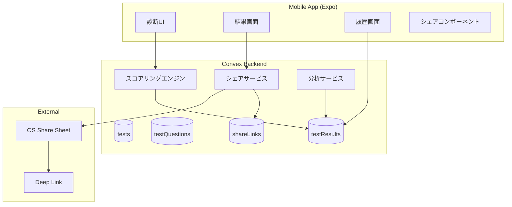
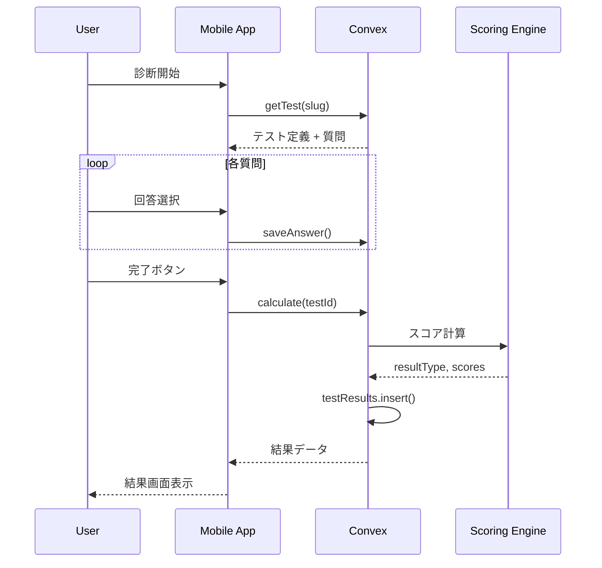
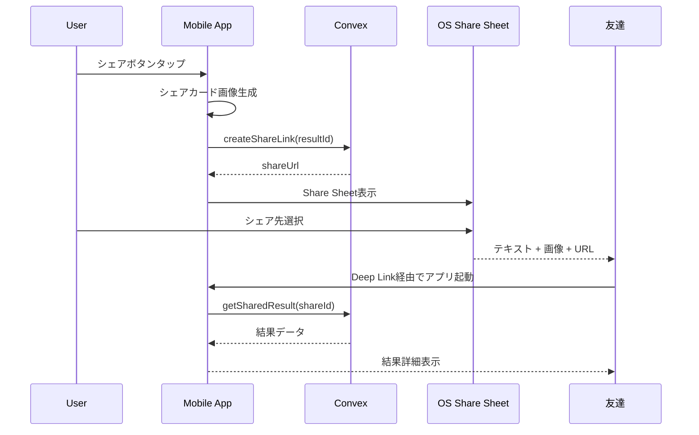
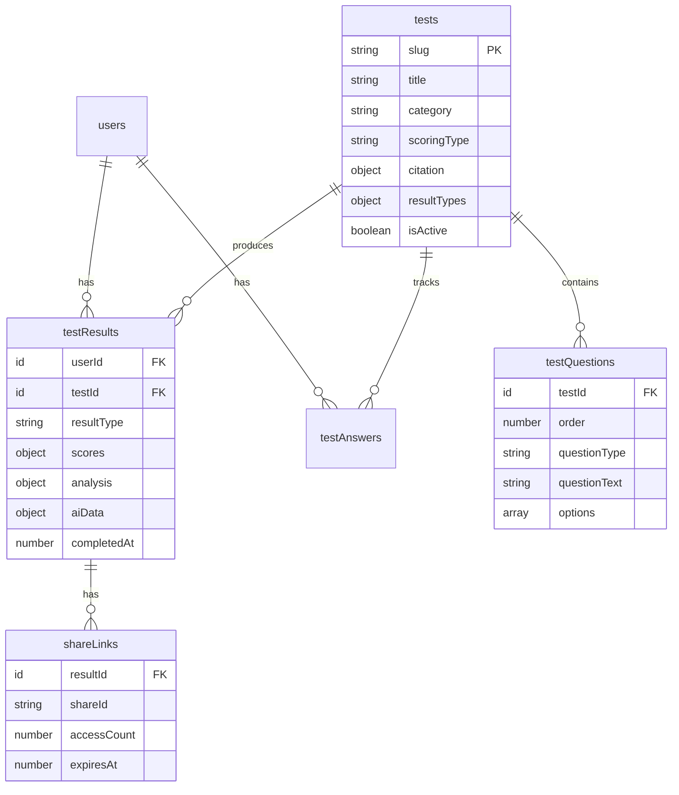

# Technical Design Document

## Overview

**Purpose**: 本機能は、科学的根拠に基づく診断テストを容易に追加・管理できる拡張可能なシステムを提供する。論文や心理学研究に裏付けられた信頼性の高い診断により、ユーザーの自己理解を支援する。

**Users**:
- **エンドユーザー**: 自己分析を行いたい一般ユーザー
- **開発者**: 新しい診断を追加・管理する開発チーム

**Impact**: 既存のMBTI、エニアグラム、キャリアタイプ診断のスキーマを拡張し、13種類の科学的診断テスト、結果履歴管理、シェア機能、AI分析連携を実現する。

### Goals
- 新診断追加がシードデータ投入のみで可能なスキーマ設計
- 4種類のスコアリングタイプ（dimension/single/scale/percentile）のサポート
- 診断結果の永続的な履歴保存と推移表示
- SNS・友達シェア機能の実装
- AI分析に最適化されたデータ構造

### Non-Goals
- AIコーチング機能の実装（将来フェーズ）
- 診断結果のリアルタイム同期を使った共同分析
- 有料診断のサブスクリプション管理（別仕様で対応）

---

## Architecture

### Existing Architecture Analysis

**現在のパターン**:
- Convex BaaS によるリアルタイムデータベース
- 認証: Clerk JWT統合
- テーブル: users, tests, testQuestions, testAnswers, testResults
- スコアリング: dimension（MBTI形式）、single（エニアグラム形式）のみ対応

**保持すべき既存コード**:
- `convex/testResults.ts`: calculateDimensionScores, calculateSingleScores
- `convex/seedTests.ts`: シードデータ投入パターン
- `convex/schema.ts`: 基本テーブル構造

**拡張対象**:
- testsテーブル: 出典情報、新スコアリングタイプ追加
- testQuestionsテーブル: 新質問タイプ対応
- testResultsテーブル: AI分析用構造化データ
- 新規: shareLinks, resultAnalysisCache テーブル

### High-Level Architecture



**Architecture Integration**:
- **Existing patterns preserved**: Convex mutation/query パターン、Clerk認証連携
- **New components rationale**: ShareLinksテーブルでシェアURL管理、AnalysisServiceでAI連携準備
- **Technology alignment**: React Native + Expo のシェア機能、Convexリアルタイム同期
- **Steering compliance**: structure.md のディレクトリ構成、tech.md の技術スタック維持

### Technology Stack and Design Decisions

**Technology Alignment**:
- Convex: 既存スキーマを拡張、新テーブル追加
- Expo: expo-sharing でOS標準シェア機能
- React Native: ViewShot でシェアカード画像生成
- i18next: 診断コンテンツの多言語対応

**Key Design Decisions**:

#### Decision 1: スコアリングエンジンの汎用化

- **Decision**: 4種類のスコアリングタイプを統一インターフェースで処理
- **Context**: 13診断で異なる計算ロジックが必要（MBTI vs HSP vs BIG5）
- **Alternatives**:
  1. 診断ごとに専用関数作成
  2. 設定ベースの汎用エンジン
  3. カスタム関数指定方式
- **Selected Approach**: 設定ベースの汎用エンジン + カスタム関数オプション
- **Rationale**: 80%の診断は標準ロジックで対応可能、特殊ケースのみカスタム関数
- **Trade-offs**: 標準ロジックの柔軟性は制限されるが、追加工数を大幅削減

#### Decision 2: シェアURL方式

- **Decision**: 短縮URLベースのDeep Link方式
- **Context**: 結果シェア時にアプリ内の特定診断結果へ遷移させたい
- **Alternatives**:
  1. Universal Links
  2. カスタムURLスキーム
  3. QRコード方式
- **Selected Approach**: Expo Router の Dynamic Links 対応
- **Rationale**: iOSとAndroid両対応、Expo標準機能で実装可能
- **Trade-offs**: Universal Links 設定が必要だが、UXは最良

---

## System Flows

### 診断実行フロー



### シェアフロー



---

## Requirements Traceability

| Requirement | Summary | Components | Interfaces |
|-------------|---------|------------|------------|
| 1.1-1.5 | 拡張可能スキーマ | tests, testQuestions | TestDefinition, QuestionType |
| 2.1-2.4 | 科学的根拠情報 | tests.citation | CitationInfo |
| 3.1-3.4 | 初期診断セット | seedTests | seedAllEvidenceBasedTests |
| 4.1-4.6 | 結果履歴管理 | testResults | ResultHistory, ResultComparison |
| 5.1-5.5 | シェア機能 | shareLinks | ShareService, ShareCard |
| 6.1-6.5 | AI分析連携 | testResults.aiData | AIDataStructure |
| 7.1-7.5 | スコアリングエンジン | ScoringEngine | ScoreCalculator |
| 8.1-8.5 | カテゴリ・フィルタ | tests.category | TestFilter |
| 9.1-9.5 | 比較・推移表示 | ResultComparison | ComparisonChart |
| 10.1-10.5 | プライバシー管理 | testResults | DataPrivacy |

---

## Components and Interfaces

### データ層 (Convex)

#### TestsTable 拡張

**Responsibility & Boundaries**
- **Primary Responsibility**: 診断テスト定義の管理
- **Domain Boundary**: 診断メタデータ、出典情報、設定
- **Data Ownership**: テスト定義、質問設定、結果タイプテンプレート

**Contract Definition**

```typescript
// tests テーブル拡張
interface TestDefinition {
  _id: Id<"tests">;
  slug: string;
  title: string;
  description: string;
  category: "personality" | "strength" | "relationship" | "lifestyle";
  questionCount: number;
  estimatedMinutes: number;

  // スコアリング設定（拡張）
  scoringType: "dimension" | "single" | "scale" | "percentile";
  scoringConfig?: {
    // dimension: 対立次元ペア定義
    dimensions?: Array<{ positive: string; negative: string }>;
    // scale: 閾値定義
    thresholds?: Array<{ min: number; max: number; label: string }>;
    // percentile: 基準値
    percentileBase?: number;
    // カスタム関数名
    customCalculator?: string;
  };

  // 出典情報（新規）
  citation: {
    authors: string[];
    title: string;
    year: number;
    doi?: string;
    url?: string;
  };

  // 結果タイプ定義（新規）
  resultTypes: Record<string, {
    summary: string;
    description: string;
    strengths: string[];
    weaknesses: string[];
    recommendations: string[];
  }>;

  // 既存フィールド
  resultField?: string;
  icon: string;
  gradientStart: string;
  gradientEnd: string;
  isActive: boolean;
  createdAt: number;
  updatedAt?: number;
}
```

#### TestQuestionsTable 拡張

**Responsibility & Boundaries**
- **Primary Responsibility**: 診断質問の管理
- **Domain Boundary**: 質問テキスト、選択肢、スコア設定

```typescript
// testQuestions テーブル拡張
interface TestQuestion {
  _id: Id<"testQuestions">;
  testId: Id<"tests">;
  order: number;
  questionText: string;

  // 質問タイプ（新規）
  questionType: "multiple" | "likert" | "forced_choice" | "slider";

  // 質問タイプ別設定
  typeConfig?: {
    // likert: スケール範囲
    likertMin?: number;
    likertMax?: number;
    likertLabels?: { min: string; max: string };
    // slider: 範囲
    sliderMin?: number;
    sliderMax?: number;
  };

  // 選択肢（multiple, forced_choice用）
  options?: Array<{
    value: string;
    label: string;
    scoreKey?: string;
    scoreValue?: string | number;
  }>;

  // スコアキー（likert, slider用）
  scoreKey?: string;
}
```

#### TestResultsTable 拡張

**Responsibility & Boundaries**
- **Primary Responsibility**: 診断結果の永続保存
- **Domain Boundary**: スコア、分析、AI連携データ

```typescript
// testResults テーブル拡張
interface TestResult {
  _id: Id<"testResults">;
  userId: Id<"users">;
  testId: Id<"tests">;
  resultType: string;
  scores: Record<string, number>;

  // 分析データ
  analysis?: {
    summary: string;
    description: string;
    strengths: string[];
    weaknesses: string[];
    recommendations: string[];
  };

  // AI分析用構造化データ（新規）
  aiData: {
    testSlug: string;
    resultType: string;
    scores: Record<string, number>;
    dimensions?: string[];
    percentiles?: Record<string, number>;
    completedAt: string; // ISO 8601
  };

  // シェア設定（新規）
  shareSettings?: {
    isPublic: boolean;
    shareId?: string;
  };

  completedAt: number;
}
```

#### ShareLinksTable（新規）

**Responsibility & Boundaries**
- **Primary Responsibility**: シェアリンクの管理
- **Domain Boundary**: URL生成、アクセス制御、統計

```typescript
// shareLinks テーブル（新規）
interface ShareLink {
  _id: Id<"shareLinks">;
  resultId: Id<"testResults">;
  userId: Id<"users">;
  shareId: string; // 短縮ID (8文字)

  // シェア設定
  expiresAt?: number;
  accessCount: number;
  maxAccessCount?: number;

  createdAt: number;
}
```

### ビジネスロジック層

#### ScoringEngine

**Responsibility & Boundaries**
- **Primary Responsibility**: スコア計算の統一処理
- **Domain Boundary**: 4種類のスコアリングタイプを処理

```typescript
interface ScoringEngine {
  // メインエントリポイント
  calculate(
    test: TestDefinition,
    questions: TestQuestion[],
    answers: Answer[]
  ): CalculationResult;
}

interface CalculationResult {
  resultType: string;
  scores: Record<string, number>;
  percentiles?: Record<string, number>;
  dimensions?: string[];
}

// スコアリングタイプ別の計算関数
interface ScoreCalculators {
  dimension: (questions: TestQuestion[], answers: Answer[], config?: DimensionConfig) => CalculationResult;
  single: (questions: TestQuestion[], answers: Answer[]) => CalculationResult;
  scale: (questions: TestQuestion[], answers: Answer[], config: ScaleConfig) => CalculationResult;
  percentile: (questions: TestQuestion[], answers: Answer[], config?: PercentileConfig) => CalculationResult;
}
```

**Preconditions**: テスト定義と全質問への回答が存在すること
**Postconditions**: 必ず resultType と scores を返す
**Invariants**: スコア計算は冪等性を保証

#### ShareService

**Responsibility & Boundaries**
- **Primary Responsibility**: シェア機能の処理
- **Domain Boundary**: リンク生成、画像生成、Deep Link

```typescript
interface ShareService {
  // シェアリンク作成
  createShareLink(resultId: Id<"testResults">): Promise<ShareLink>;

  // シェアカードデータ取得
  getShareCardData(resultId: Id<"testResults">): Promise<ShareCardData>;

  // シェア結果取得（公開）
  getSharedResult(shareId: string): Promise<PublicResult | null>;
}

interface ShareCardData {
  testTitle: string;
  resultType: string;
  resultLabel: string;
  scoreVisualization: ScoreVisualization[];
  appLogo: string;
  downloadUrl: string;
}
```

### プレゼンテーション層

#### ShareCardComponent

**Responsibility & Boundaries**
- **Primary Responsibility**: シェア用画像の生成
- **Dependencies**: react-native-view-shot

```typescript
interface ShareCardProps {
  testTitle: string;
  resultType: string;
  resultLabel: string;
  scores: Record<string, number>;
  gradientColors: [string, string];
}

// コンポーネント出力
// <ShareCard /> → ViewShot でキャプチャ → Base64画像
```

#### ResultHistoryScreen

**Responsibility & Boundaries**
- **Primary Responsibility**: 結果履歴一覧の表示
- **Dependencies**: convex useQuery

```typescript
interface ResultHistoryScreenProps {
  // 内部でuseQuery(api.testResults.listByUser)を使用
}

// 表示項目
// - 診断名、結果タイプ、完了日
// - 同診断の複数結果 → 比較ボタン表示
```

---

## Data Models

### Domain Model

**Core Concepts**:
- **Test (Entity)**: 診断テストの定義。出典情報を持ち、質問セットを所有
- **Question (Entity)**: 質問項目。テストに従属し、スコア設定を持つ
- **Result (Entity)**: 診断結果。ユーザーごとに複数保存可能
- **ShareLink (Value Object)**: 一時的なシェアURL。結果に従属

**Business Rules & Invariants**:
- 1つのテストには1つ以上の質問が必要
- 結果保存時、全質問への回答が必須
- シェアリンクは有効期限内のみアクセス可能
- ユーザーは自分の結果のみ削除可能

### Logical Data Model



### Physical Data Model (Convex)

**Convex Schema Extensions**:

```typescript
// convex/schema.ts への追加

// tests テーブル拡張
tests: defineTable({
  // 既存フィールド...

  // 新規: 出典情報
  citation: v.optional(v.object({
    authors: v.array(v.string()),
    title: v.string(),
    year: v.number(),
    doi: v.optional(v.string()),
    url: v.optional(v.string()),
  })),

  // 新規: スコアリング設定
  scoringConfig: v.optional(v.object({
    dimensions: v.optional(v.array(v.object({
      positive: v.string(),
      negative: v.string(),
    }))),
    thresholds: v.optional(v.array(v.object({
      min: v.number(),
      max: v.number(),
      label: v.string(),
    }))),
    percentileBase: v.optional(v.number()),
    customCalculator: v.optional(v.string()),
  })),

  // 新規: 結果タイプ定義
  resultTypes: v.optional(v.any()),

  updatedAt: v.optional(v.number()),
})
  .index("by_slug", ["slug"])
  .index("by_category", ["category"])
  .index("by_active", ["isActive"]),

// testQuestions 拡張
testQuestions: defineTable({
  // 既存フィールド...

  // 新規: 質問タイプ
  questionType: v.optional(v.string()), // デフォルト: "multiple"

  // 新規: タイプ別設定
  typeConfig: v.optional(v.object({
    likertMin: v.optional(v.number()),
    likertMax: v.optional(v.number()),
    likertLabels: v.optional(v.object({
      min: v.string(),
      max: v.string(),
    })),
    sliderMin: v.optional(v.number()),
    sliderMax: v.optional(v.number()),
  })),

  // 新規: スコアキー（likert/slider用）
  scoreKey: v.optional(v.string()),
}),

// testResults 拡張
testResults: defineTable({
  // 既存フィールド...

  // 新規: AI分析用データ
  aiData: v.optional(v.object({
    testSlug: v.string(),
    resultType: v.string(),
    scores: v.any(),
    dimensions: v.optional(v.array(v.string())),
    percentiles: v.optional(v.any()),
    completedAt: v.string(),
  })),

  // 新規: シェア設定
  shareSettings: v.optional(v.object({
    isPublic: v.boolean(),
    shareId: v.optional(v.string()),
  })),
}),

// 新規: shareLinks テーブル
shareLinks: defineTable({
  resultId: v.id("testResults"),
  userId: v.id("users"),
  shareId: v.string(),
  expiresAt: v.optional(v.number()),
  accessCount: v.number(),
  maxAccessCount: v.optional(v.number()),
  createdAt: v.number(),
})
  .index("by_shareId", ["shareId"])
  .index("by_result", ["resultId"])
  .index("by_user", ["userId"]),
```

---

## Error Handling

### Error Strategy

診断システムにおけるエラーは以下のカテゴリで処理する。

### Error Categories and Responses

**User Errors (4xx)**:
- 未認証でのアクセス → サインイン画面へリダイレクト
- 存在しない診断へのアクセス → 404画面 + 診断一覧へ誘導
- 不完全な回答での結果計算 → エラートースト + 未回答質問へ遷移

**System Errors (5xx)**:
- Convex接続エラー → リトライ + オフラインキャッシュ表示
- スコア計算エラー → エラーログ + ユーザーへ報告依頼

**Business Logic Errors (422)**:
- シェアリンク期限切れ → 期限切れメッセージ + アプリDL誘導
- 非公開結果へのアクセス → プライバシー設定説明

### Monitoring

- Convex ダッシュボードでのエラー監視
- クリティカルエラーは Sentry 連携（将来）
- シェアリンクアクセス統計の定期レポート

---

## Testing Strategy

### Unit Tests
- `calculateDimensionScores`: MBTI全16タイプの正しい計算
- `calculateSingleScores`: エニアグラム9タイプの正しい計算
- `calculateScaleScores`: HSP閾値判定の正確性
- `calculatePercentileScores`: BIG5パーセンタイル計算
- `generateShareId`: 短縮IDのユニーク性検証

### Integration Tests
- 診断開始 → 回答保存 → 結果計算 → 結果保存の一連フロー
- シェアリンク作成 → シェアカード生成 → リンクアクセス
- Deep Link経由でのアプリ起動 → 結果画面遷移
- 複数結果の比較画面表示

### E2E Tests
- 新規ユーザーがMBTI診断を完了するまでのフロー
- 結果をSNSシェアして友達がリンクを開くフロー
- 過去の結果履歴から比較画面を表示するフロー

### Performance Tests
- 50問診断の回答保存レスポンス（< 500ms目標）
- 結果履歴100件の一覧取得（< 1s目標）
- シェアカード画像生成（< 2s目標）

---

## Security Considerations

### Authentication & Authorization

- **認証**: Clerk JWT による全API認証
- **認可**: userId による結果データのスコープ制限
- **シェアリンク**: 公開設定された結果のみアクセス可能

### Data Protection

- **個人データ**: testResults は userId でスコープ化
- **シェア制御**: shareSettings.isPublic = false はオーナーのみアクセス
- **削除機能**: ユーザーによる個別/全削除を実装

### Privacy Compliance

- 診断データの第三者共有なし（シェア機能除く）
- データエクスポート機能（JSON形式）
- アカウント削除時の全データ削除

---

## Migration Strategy

### Phase 1: スキーマ拡張


**Process**:
1. tests テーブルに citation, scoringConfig, resultTypes 追加
2. testQuestions に questionType, typeConfig, scoreKey 追加
3. testResults に aiData, shareSettings 追加
4. shareLinks テーブル新規作成

**Rollback Trigger**: スキーマ変更後のCRUD操作エラー率 > 1%

### Phase 2: スコアリングエンジン

1. scale, percentile 計算関数追加
2. 既存 dimension, single 関数のリファクタリング
3. 統一インターフェース ScoringEngine 実装

### Phase 3: シェア機能

1. ShareService 実装
2. Deep Link 設定
3. シェアカードコンポーネント実装
4. E2Eテスト

### Phase 4: 初期診断データ投入

1. seedEvidenceBasedTests 関数作成
2. 13診断のシードデータ準備
3. 段階的投入（Tier 1 → 2 → 3 → 4）
