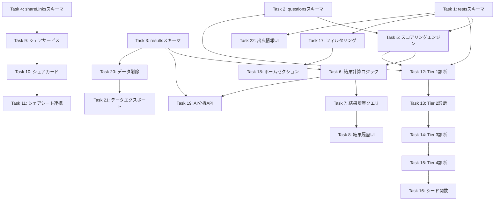

# Implementation Tasks

## Overview

本タスクリストは、科学的根拠に基づく診断システムの実装に必要な全タスクを定義します。

**優先度レベル**:
- 🔴 **Critical**: ブロッカータスク。他のタスクに依存される
- 🟡 **High**: 主要機能の実装
- 🟢 **Medium**: 拡張機能・改善
- ⚪ **Low**: 最適化・追加機能

**ステータス**:
- [ ] 未着手
- [x] 完了

---

## Phase 1: スキーマ拡張

### Task 1: testsテーブルのスキーマ拡張
🔴 **Critical** | 見積もり: 1時間

#### 1.1 出典情報フィールドの追加
`convex/schema.ts`のtestsテーブルにcitationオブジェクトを追加する。

- [x] `citation`フィールド追加（authors, title, year, doi, url）
- [x] `scoringConfig`フィールド追加（dimensions, thresholds, percentileBase, customCalculator）
- [x] `resultTypes`フィールド追加（Record<string, ResultTypeDefinition>）
- [x] `updatedAt`フィールド追加
- [x] `by_category`インデックス追加

_Requirements: 1.2, 2.1, 2.2_

#### 1.2 スコアリングタイプの拡張
既存の`scoringType`に新しい値を追加する。

- [x] `scoringType`を`"dimension" | "single" | "scale" | "percentile"`に拡張
- [x] TypeScript型定義の更新

_Requirements: 1.5, 7.1-7.4_

---

### Task 2: testQuestionsテーブルのスキーマ拡張
🔴 **Critical** | 見積もり: 45分

#### 2.1 質問タイプフィールドの追加
複数の質問タイプをサポートするためのフィールドを追加する。

- [x] `questionType`フィールド追加（multiple, likert, forced_choice, slider）
- [x] `typeConfig`フィールド追加（likertMin/Max, likertLabels, sliderMin/Max）
- [x] `scoreKey`フィールド追加（likert/slider用）
- [x] 既存データとの後方互換性確認

_Requirements: 1.3_

---

### Task 3: testResultsテーブルのスキーマ拡張
🔴 **Critical** | 見積もり: 45分

#### 3.1 AI分析用データ構造の追加
AI連携に適した構造化データを保存するフィールドを追加する。

- [x] `aiData`フィールド追加（testSlug, resultType, scores, dimensions, percentiles, completedAt）
- [x] `shareSettings`フィールド追加（isPublic, shareId）
- [x] 既存結果データへの影響確認

_Requirements: 6.1, 6.2_

---

### Task 4: shareLinksテーブルの新規作成
🟡 **High** | 見積もり: 30分

#### 4.1 シェアリンク管理テーブルの作成
シェアURLを管理するための新規テーブルを作成する。

- [x] `shareLinks`テーブル定義（resultId, userId, shareId, expiresAt, accessCount, createdAt）
- [x] `by_shareId`インデックス追加
- [x] `by_result`インデックス追加
- [x] `by_user`インデックス追加

_Requirements: 5.1, 5.2_

---

## Phase 2: スコアリングエンジン

### Task 5: スコアリングエンジンの汎用化
🔴 **Critical** | 見積もり: 3時間

#### 5.1 既存スコアリング関数のリファクタリング
`convex/testResults.ts`の既存関数を統一インターフェースに対応させる。

- [x] `calculateDimensionScores`関数のリファクタリング
- [x] `calculateSingleScores`関数のリファクタリング
- [x] 共通型定義（CalculationResult, ScoreCalculators）の作成

_Requirements: 7.1, 7.2_

#### 5.2 scale型スコアリングの実装
合計スコアを算出し閾値判定するスコアリング方式を実装する。

- [x] `calculateScaleScores`関数の新規作成
- [x] 閾値設定からの結果タイプ判定ロジック
- [x] HSP診断用の閾値設定サンプル

_Requirements: 7.3_

#### 5.3 percentile型スコアリングの実装
各次元のパーセンタイルを計算するスコアリング方式を実装する。

- [x] `calculatePercentileScores`関数の新規作成
- [x] 5因子それぞれのパーセンタイル計算ロジック
- [x] BIG5診断用の基準値設定サンプル

_Requirements: 7.4_

#### 5.4 統一スコアリングエンジンの実装
全スコアリングタイプを統一インターフェースで処理するエンジンを実装する。

- [x] `ScoringEngine`クラス/関数の作成
- [x] scoringTypeに基づく計算関数のルーティング
- [x] カスタム計算関数の呼び出し対応
- [x] エラーハンドリングとバリデーション

_Requirements: 7.5_

---

### Task 6: 結果計算・保存ロジックの更新
🟡 **High** | 見積もり: 2時間

#### 6.1 calculateAndSave関数の拡張
新しいスコアリングエンジンを使用するように結果計算関数を更新する。

- [x] ScoringEngineを使用した計算処理への置き換え
- [x] aiDataの自動生成・保存
- [x] resultTypesからの分析データ取得
- [x] 既存のMBTI/エニアグラム/キャリア診断との互換性維持

_Requirements: 4.2, 6.1_

#### 6.2 結果タイプ分析の動的取得
診断定義からresultTypesを参照して分析データを取得する。

- [x] testsテーブルからresultTypes取得
- [x] resultTypeに基づくanalysis生成
- [x] フォールバック処理（既存のMBTI_ANALYSISとの互換）

_Requirements: 3.3_

---

## Phase 3: 結果履歴管理

### Task 7: 結果履歴クエリの実装
🟡 **High** | 見積もり: 1.5時間

#### 7.1 ユーザー結果一覧取得
ユーザーの過去診断結果を一覧取得するクエリを実装する。

- [x] `api.testResults.listByUser`クエリ作成
- [x] 新しい順でのソート
- [x] 診断情報（タイトル、カテゴリ）のjoin

_Requirements: 4.3, 4.4_

#### 7.2 診断別結果履歴取得
同じ診断の複数回結果を時系列で取得するクエリを実装する。

- [x] `api.testResults.getByTestAndUser`クエリ作成
- [x] 時系列ソート
- [x] 比較用のスコア差分計算

_Requirements: 4.5, 9.1_

#### 7.3 結果詳細取得
特定の結果IDから完全な分析レポートを取得するクエリを実装する。

- [x] `api.testResults.getById`クエリ作成
- [x] 診断定義情報のjoin
- [x] 出典情報の含有

_Requirements: 4.6_

---

### Task 8: 結果履歴UIの実装
🟡 **High** | 見積もり: 3時間

#### 8.1 結果履歴一覧画面
プロフィール画面に過去の診断結果一覧を表示する。

- [x] `components/ResultHistoryList.tsx`作成
- [x] 診断名、結果タイプ、完了日の表示
- [x] 結果詳細画面への遷移

_Requirements: 4.3, 4.4_

#### 8.2 結果比較画面
同じ診断の複数結果を比較表示する画面を実装する。

- [x] `components/ResultComparisonScreen.tsx`作成
- [x] 各次元のスコア変化グラフ
- [x] 日付ごとの結果タイプ変化表示
- [x] 成長ポイントのハイライト

_Requirements: 9.1, 9.2, 9.3, 9.4, 9.5_

---

## Phase 4: シェア機能

### Task 9: シェアサービスの実装
🟡 **High** | 見積もり: 2時間

#### 9.1 シェアリンク作成
結果のシェアリンクを生成するmutationを実装する。

- [x] `api.shareLinks.create`mutation作成
- [x] 8文字の短縮ID生成（nanoid使用）
- [x] 有効期限設定オプション
- [x] shareLinksテーブルへの保存

_Requirements: 5.1, 5.2_

#### 9.2 シェア結果取得
シェアIDから公開結果を取得するqueryを実装する。

- [x] `api.shareLinks.getSharedResult`query作成
- [x] 有効期限チェック
- [x] アクセスカウントインクリメント
- [x] 非公開設定チェック

_Requirements: 5.4_

#### 9.3 シェア設定管理
ユーザーが結果の公開/非公開を選択できるmutationを実装する。

- [x] `api.testResults.updateShareSettings`mutation作成
- [x] isPublicフラグの更新
- [x] 関連shareLinksの無効化オプション

_Requirements: 5.5_

---

### Task 10: シェアカードコンポーネントの実装
🟡 **High** | 見積もり: 2.5時間

#### 10.1 シェアカードUI
シェア用画像として使用するカードコンポーネントを作成する。

- [x] `components/ShareCard.tsx`作成
- [x] 診断名、結果タイプ表示
- [x] 主要スコアのビジュアライゼーション
- [x] Pernectロゴとダウンロードリンク
- [x] グラデーション背景

_Requirements: 5.3_

#### 10.2 画像キャプチャ機能
シェアカードを画像として保存する機能を実装する。

- [x] react-native-view-shot統合
- [x] キャプチャ → Base64変換
- [x] 一時ファイル保存

_Requirements: 5.2_

---

### Task 11: シェアシート連携
🟡 **High** | 見積もり: 1.5時間

#### 11.1 OSシェアシート呼び出し
expo-sharingを使用してOSのシェアシートを表示する。

- [x] expo-sharingの設定
- [x] テキスト（結果サマリー + アプリリンク）シェア
- [x] 画像（シェアカード）シェア
- [x] シェアボタンUI実装

_Requirements: 5.1, 5.2_

#### 11.2 Deep Link設定
シェアリンクからアプリ内の診断結果に遷移する設定を行う。

- [x] app.jsonのscheme設定
- [x] Expo Routerでのdeep link処理
- [x] シェア元診断ページへの遷移ロジック

_Requirements: 5.4_

---

## Phase 5: 初期診断セット

### Task 12: Tier 1 診断データの作成
🔴 **Critical** | 見積もり: 4時間

#### 12.1 MBTI診断の拡張
既存MBTI診断に出典情報と新スキーマ対応を追加する。

- [x] citation情報追加（ユング/マイヤーズ・ブリッグス）
- [x] resultTypes定義（主要タイプ: ENFP, INTJ, INFP, ENTJ等）
- [x] scoringConfig設定（4次元: E/I, S/N, T/F, J/P）
- [x] 既存質問データの維持

_Requirements: 3.4_

#### 12.2 BIG5診断の新規作成
ビッグファイブ診断の完全なシードデータを作成する。

- [x] テスト定義（Costa & McCrae出典）
- [x] percentileタイプのスコアリング設定
- [x] 5因子の詳細分析テンプレート（High-O, High-C, High-E, High-A, High-N）

_Requirements: 3.1, 3.2, 3.3_

#### 12.3 エニアグラム診断の拡張
既存エニアグラム診断に出典情報と新スキーマ対応を追加する。

- [x] citation情報追加（Riso & Hudson）
- [x] resultTypes定義（9タイプ全て）
- [x] singleタイプのスコアリング設定

_Requirements: 3.4_

---

### Task 13: Tier 2 診断データの作成
🟡 **High** | 見積もり: 4時間

#### 13.1 VIA強み診断の新規作成
24の性格強みを診断するシードデータを作成する。

- [x] テスト定義（セリグマン & ピーターソン出典）
- [ ] 48-72問の質問セット
- [x] percentileタイプのスコアリング設定
- [x] トップ5強みの分析テンプレート

_Requirements: 3.1, 3.2, 3.3_

#### 13.2 グリット診断の新規作成
やり抜く力を測定するシードデータを作成する。

- [x] テスト定義（アンジェラ・ダックワース出典）
- [ ] 10-12問の質問セット
- [x] scaleタイプのスコアリング設定
- [x] グリットレベル別分析テンプレート

_Requirements: 3.1, 3.2, 3.3_

#### 13.3 EQ診断の新規作成
感情知能を測定するシードデータを作成する。

- [x] テスト定義（ダニエル・ゴールマン出典）
- [ ] 25-40問の質問セット
- [x] percentileタイプのスコアリング設定（5能力）
- [x] EQ能力別分析テンプレート

_Requirements: 3.1, 3.2, 3.3_

---

### Task 14: Tier 3 診断データの作成
🟡 **High** | 見積もり: 4時間

#### 14.1 愛着スタイル診断の新規作成
4つの愛着スタイルを診断するシードデータを作成する。

- [x] テスト定義（ボウルビィ出典）
- [ ] 20-30問の質問セット
- [x] dimensionタイプのスコアリング設定
- [x] 4スタイル別分析テンプレート

_Requirements: 3.1, 3.2, 3.3_

#### 14.2 5つの愛の言語診断の新規作成
愛の表現スタイルを診断するシードデータを作成する。

- [x] テスト定義（ゲイリー・チャップマン出典）
- [ ] 30問の質問セット（ペア比較式）
- [x] singleタイプのスコアリング設定
- [x] 5言語別分析テンプレート

_Requirements: 3.1, 3.2, 3.3_

#### 14.3 DiSCスタイル診断の新規作成
コミュニケーションスタイルを診断するシードデータを作成する。

- [x] テスト定義（ウィリアム・マーストン出典）
- [ ] 28-40問の質問セット
- [x] dimensionタイプのスコアリング設定
- [x] 4スタイル別分析テンプレート

_Requirements: 3.1, 3.2, 3.3_

---

### Task 15: Tier 4 診断データの作成
🟡 **High** | 見積もり: 4時間

#### 15.1 HSP診断の新規作成
繊細さを測定するシードデータを作成する。

- [x] テスト定義（エレイン・アーロン博士出典）
- [ ] 27問の質問セット（公式スケール）
- [x] scaleタイプのスコアリング設定
- [x] HSPレベル別分析テンプレート

_Requirements: 3.1, 3.2, 3.3_

#### 15.2 マネースクリプト診断の新規作成
金銭心理を診断するシードデータを作成する。

- [x] テスト定義（ブラッド・クロンツ博士出典）
- [ ] 20-30問の質問セット
- [x] singleタイプのスコアリング設定
- [x] 4スクリプト別分析テンプレート

_Requirements: 3.1, 3.2, 3.3_

#### 15.3 ストレスコーピング診断の新規作成
ストレス対処スタイルを診断するシードデータを作成する。

- [x] テスト定義（ラザルス & フォルクマン出典）
- [ ] 28-40問の質問セット
- [x] percentileタイプのスコアリング設定
- [x] コーピングスタイル別分析テンプレート

_Requirements: 3.1, 3.2, 3.3_

#### 15.4 VARK学習スタイル診断の新規作成
学習スタイルを診断するシードデータを作成する。

- [x] テスト定義（ニール・フレミング出典）
- [ ] 16問の質問セット（公式形式）
- [x] singleタイプのスコアリング設定
- [x] 4スタイル別分析テンプレート

_Requirements: 3.1, 3.2, 3.3_

---

### Task 16: シードデータ投入関数
🟡 **High** | 見積もり: 2時間

#### 16.1 統合シード関数の作成
全13診断を投入する統合シード関数を作成する。

- [x] `convex/seedEvidenceBasedTests.ts`作成
- [x] 既存テスト重複チェック
- [x] Tier別の段階的投入オプション
- [x] 投入結果のログ出力

_Requirements: 3.1_

---

## Phase 6: カテゴリ・フィルタリング

### Task 17: テスト一覧フィルタリング
🟢 **Medium** | 見積もり: 2時間

#### 17.1 カテゴリフィルタクエリ
カテゴリでフィルタリングするクエリを実装する。

- [x] `api.tests.listByCategory`クエリ作成（`list`と`listWithStatus`で対応）
- [x] カテゴリタブUI対応（`getCategories`で4カテゴリ定義）
- [x] 4カテゴリ（personality, strength, relationship, lifestyle）

_Requirements: 8.1, 8.2_

#### 17.2 検索クエリ
タイトル・説明文で診断を検索するクエリを実装する。

- [x] `api.tests.search`クエリ作成
- [x] 部分一致検索
- [x] 検索バーUI対応

_Requirements: 8.3_

---

### Task 18: ホーム画面セクション
🟢 **Medium** | 見積もり: 2時間

#### 18.1 人気の診断セクション
受験数順で診断を表示するセクションを実装する。

- [x] 受験数カウントロジック
- [x] `api.tests.getPopular`クエリ作成
- [x] ホーム画面への統合

_Requirements: 8.4_

#### 18.2 おすすめセクション
未受験かつカテゴリマッチの診断を表示する。

- [x] ユーザー受験履歴チェック
- [x] カテゴリ親和性判定
- [x] `api.tests.getRecommended`クエリ作成

_Requirements: 8.4_

#### 18.3 受験済みバッジ
完了した診断にバッジを表示する。

- [x] ユーザー別受験履歴取得（`listWithStatus`で対応）
- [x] テストカードへのバッジUI追加

_Requirements: 8.5_

---

## Phase 7: AI分析連携

### Task 19: AI分析用API
🟢 **Medium** | 見積もり: 1.5時間

#### 19.1 統合プロファイルAPI
全診断結果を一括取得するAPIを実装する。

- [x] `api.testResults.getIntegratedProfile`クエリ作成
- [x] aiDataの構造化レスポンス
- [x] 横断的サマリー生成

_Requirements: 6.2, 6.3, 6.4_

#### 19.2 分析キャッシュ更新
新しい結果追加時にAI分析用キャッシュを更新する。

- [x] 結果保存時のキャッシュ更新トリガー（`calculate`mutationで自動生成）
- [x] インデックス最適化

_Requirements: 6.5_

---

## Phase 8: プライバシー・データ管理

### Task 20: データ削除機能
🟢 **Medium** | 見積もり: 1.5時間

#### 20.1 個別結果削除
特定の診断結果を削除するmutationを実装する。

- [x] `api.testResults.deleteResult`mutation作成
- [x] 認証チェック（自分の結果のみ）
- [x] 関連shareLinksの削除
- [x] 確認ダイアログUI

_Requirements: 10.3_

#### 20.2 全履歴削除
全ての診断履歴を削除するmutationを実装する。

- [x] `api.testResults.deleteAllResults`mutation作成
- [x] 確認ダイアログ（二重確認）
- [x] 関連shareLinksの一括削除

_Requirements: 10.2_

---

### Task 21: データエクスポート機能
🟢 **Medium** | 見積もり: 1.5時間

#### 21.1 JSON形式エクスポート
全診断結果をJSON形式でダウンロードする機能を実装する。

- [x] `api.testResults.exportData`クエリ作成
- [x] AI分析用構造でのエクスポート
- [x] ファイル保存UI

_Requirements: 10.4_

---

## Phase 9: 出典情報表示

### Task 22: 出典情報UI
🟢 **Medium** | 見積もり: 1.5時間

#### 22.1 診断詳細での出典表示
診断詳細画面に出典情報を表示する。

- [x] 著者名、論文タイトル、出版年の表示（`CitationInfo`コンポーネント）
- [x] DOI/URLリンク（タップで外部ブラウザ）
- [x] 信頼性バッジ（研究ベース/実証済み）

_Requirements: 2.1, 2.2, 2.3_

#### 22.2 診断一覧での信頼性バッジ
一覧画面で信頼性指標をバッジ表示する。

- [x] テストカードへのバッジUI追加（`CitationSection`コンポーネント）
- [x] カテゴリ別色分け

_Requirements: 2.4_

---

## Completion Checklist

### Phase 1: スキーマ拡張
- [x] Task 1: testsテーブル拡張
- [x] Task 2: testQuestionsテーブル拡張
- [x] Task 3: testResultsテーブル拡張
- [x] Task 4: shareLinksテーブル作成

### Phase 2: スコアリングエンジン
- [x] Task 5: スコアリングエンジン汎用化
- [x] Task 6: 結果計算ロジック更新

### Phase 3: 結果履歴管理
- [x] Task 7: 結果履歴クエリ
- [x] Task 8: 結果履歴UI

### Phase 4: シェア機能
- [x] Task 9: シェアサービス
- [x] Task 10: シェアカードコンポーネント
- [x] Task 11: シェアシート連携

### Phase 5: 初期診断セット
- [x] Task 12: Tier 1 診断（MBTI, BIG5, エニアグラム）
- [x] Task 13: Tier 2 診断（VIA, グリット, EQ）- テスト定義完了、質問セット未作成
- [x] Task 14: Tier 3 診断（愛着, 愛の言語, DiSC）- テスト定義完了、質問セット未作成
- [x] Task 15: Tier 4 診断（HSP, マネー, コーピング, VARK）- テスト定義完了、質問セット未作成
- [x] Task 16: シードデータ投入関数

### Phase 6: カテゴリ・フィルタリング
- [x] Task 17: テスト一覧フィルタリング
- [x] Task 18: ホーム画面セクション

### Phase 7: AI分析連携
- [x] Task 19: AI分析用API

### Phase 8: プライバシー・データ管理
- [x] Task 20: データ削除機能
- [x] Task 21: データエクスポート機能

### Phase 9: 出典情報表示
- [x] Task 22: 出典情報UI

---

## Dependencies

---

## Notes

### 実装順序の推奨

1. **Week 1**: Phase 1 (スキーマ拡張) + Task 5.1-5.2 (スコアリング基盤)
2. **Week 2**: Task 5.3-5.4 + Phase 3 (結果履歴)
3. **Week 3**: Phase 4 (シェア機能)
4. **Week 4**: Task 12 (Tier 1 診断データ)
5. **Week 5**: Task 13-14 (Tier 2-3 診断データ)
6. **Week 6**: Task 15-16 (Tier 4 + シード関数)
7. **Week 7**: Phase 6-9 (残り機能)

### 技術的注意点

- スキーマ変更は後方互換性を維持すること
- 既存のMBTI/エニアグラム/キャリア診断は動作を維持
- シードデータは開発環境でのみ実行
- シェアカード画像生成はメモリ使用量に注意
