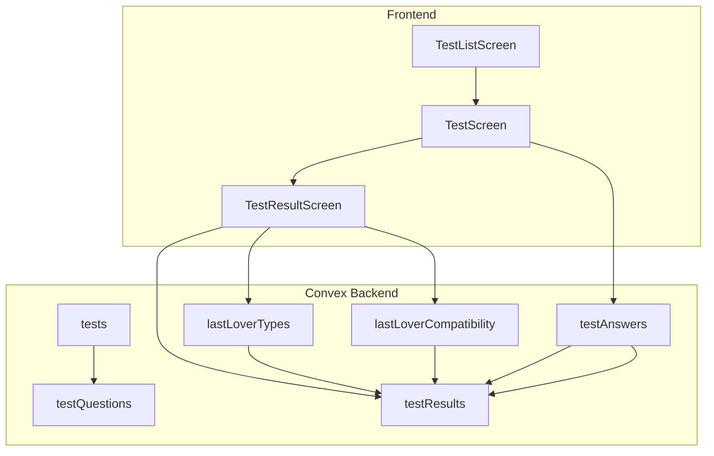
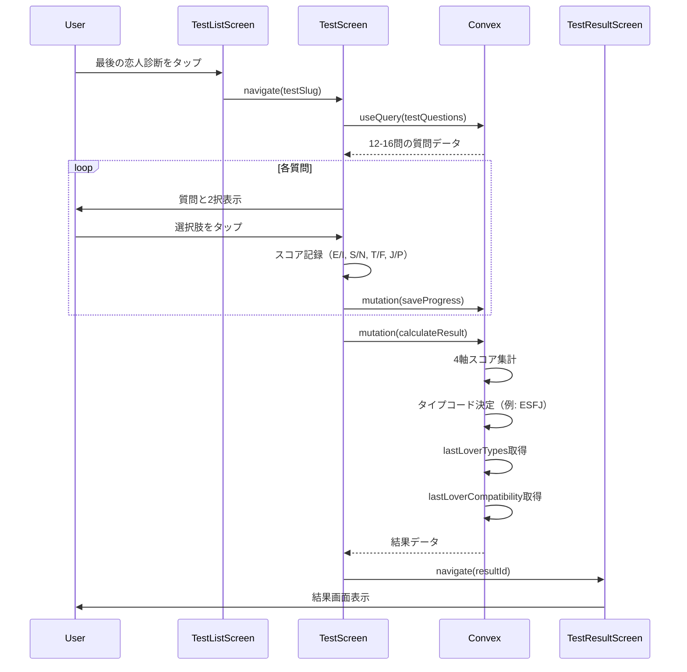
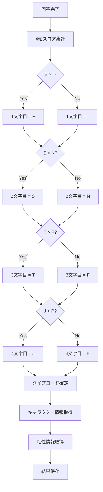
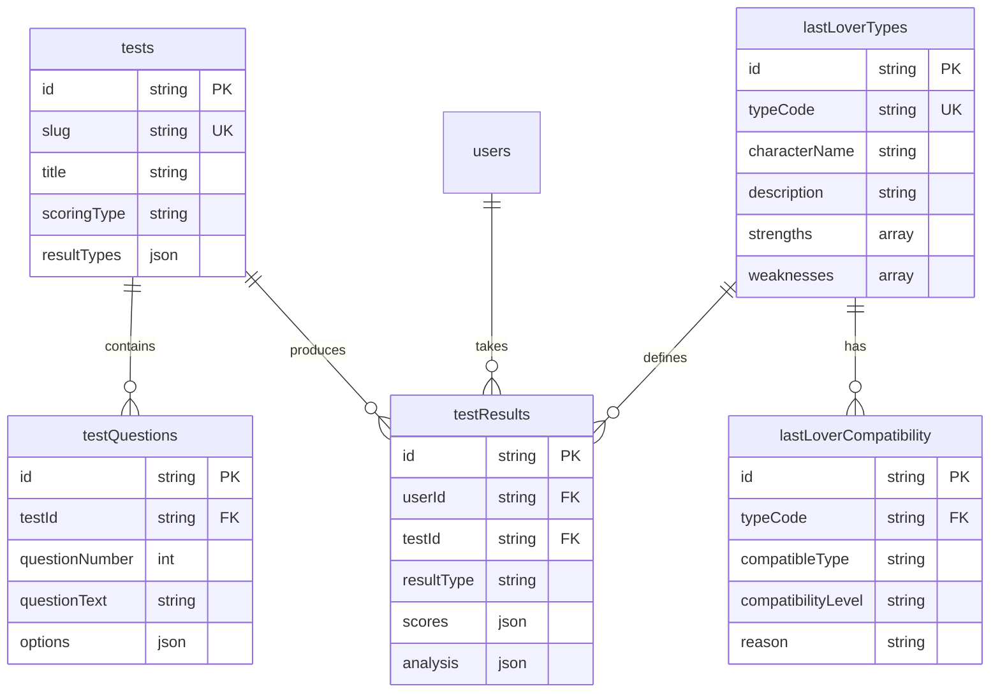

# Technical Design Document: Last Lover Test

## Overview

**Purpose**: 最後の恋人診断（Last Lover Test）は、恋愛における行動パターンと価値観を4つの軸で分析し、16種類の恋愛キャラクタータイプに分類する診断機能です。既存のテストインフラストラクチャを拡張し、ビジュアルリッチな結果画面とSNSシェア機能への基盤を提供します。

**Users**: 若年層ユーザー（10代後半〜30代前半）が主要ターゲット。恋愛診断に興味があり、SNSで結果をシェアしたいユーザー。

**Impact**: 既存の`tests`テーブルに新規テストデータを追加し、16タイプの恋愛キャラクター定義と相性データを新規テーブルに格納。TestScreen/TestResultScreenコンポーネントは既存パターンを活用。

### Goals
- 4軸×2択による16タイプの恋愛性格診断の実装
- ピンク〜パープル系グラデーションの恋愛テーマUI
- 相性診断機能（良い相性・注意が必要な相性）
- 既存テストインフラストラクチャとの統合

### Non-Goals
- SNSシェア用カード画像生成（将来フェーズ）
- 他ユーザーとの相性マッチング機能
- リアルタイムチャット・マッチング機能
- 外部APIとの統合（占い、星座等）

## Architecture

### Existing Architecture Analysis

既存のテストシステムは以下のパターンで構成されています：

- **scoringType: "dimension"**: MBTI型の対立軸診断に対応済み
- **testQuestions.options.scoreKey/scoreValue**: 軸別スコア加算に対応
- **testResults.analysis**: タイプ別の詳細分析を格納
- **TestScreen**: 進捗保存、選択肢表示、自動遷移に対応
- **TestResultScreen**: dimension型スコアバー表示に対応

### High-Level Architecture



### Technology Alignment

**既存パターンの活用**:
- `scoringType: "dimension"` - 4軸診断のスコア計算に使用
- `MBTI_ANALYSIS` パターン - 16タイプの分析定義テンプレート
- `calculateDimensionScores()` - 軸別スコア集計ロジック
- `renderDimensionScores()` - 軸別スコアバー表示

**新規追加**:
- `lastLoverTypes` テーブル - 16タイプのキャラクター定義
- `lastLoverCompatibility` テーブル - タイプ間相性データ
- 恋愛テーマ用カラースキーム（ピンク〜パープル）

### Key Design Decisions

**Decision 1: 既存dimension scoringの活用**
- **Context**: 4軸×2択の診断スコア計算が必要
- **Alternatives**: カスタムスコアリング実装、新規scoringType追加
- **Selected Approach**: 既存の`scoringType: "dimension"`と`scoreKey/scoreValue`パターンを使用
- **Rationale**: MBTI診断で実証済みのパターン。コード重複を避け、保守性を維持
- **Trade-offs**: 柔軟性は若干制限されるが、実装コストと信頼性で優位

**Decision 2: 相性データの別テーブル管理**
- **Context**: 16×16=256通りの相性情報を管理する必要がある
- **Alternatives**: JSON形式でtests内に埋め込み、resultsに直接記載
- **Selected Approach**: `lastLoverCompatibility`専用テーブルで正規化管理
- **Rationale**: クエリ効率、データ更新の容易さ、将来の拡張性
- **Trade-offs**: テーブル数増加だが、データ整合性と保守性で優位

## System Flows

### 診断フロー



### スコア計算フロー



## Requirements Traceability

| Requirement | Summary | Components | Data |
|-------------|---------|------------|------|
| 1 | 診断テスト基本構造 | TestScreen | tests, testQuestions |
| 2 | 4軸タイプ判定 | calculateResult mutation | testResults.scores |
| 3 | 16種類キャラクター | TestResultScreen | lastLoverTypes |
| 4 | 相性診断機能 | TestResultScreen | lastLoverCompatibility |
| 5 | ビジュアルリッチ結果 | TestResultScreen | gradients, animations |
| 6 | 質問画面UI/UX | TestScreen | test.gradientStart/End |
| 7 | 結果保存・履歴 | testResults mutation | testResults |
| 8 | テスト一覧統合 | TestListScreen | tests |
| 9 | データモデル | Convex schema | 全テーブル |
| 10 | パフォーマンス | TestScreen, cache | testAnswers |

## Components and Interfaces

### Convex Backend

#### lastLoverTypes テーブル

**Responsibility & Boundaries**
- **Primary Responsibility**: 16種類の恋愛キャラクタータイプ定義を格納
- **Domain Boundary**: Last Lover診断専用データ
- **Data Ownership**: タイプコード、キャラクター名、説明、恋愛傾向

**Schema Definition**
```typescript
lastLoverTypes: defineTable({
  typeCode: v.string(),           // "ESFJ", "INFP", etc.
  characterName: v.string(),      // "献身的な世話焼きさん"
  emoji: v.string(),              // "💝"
  summary: v.string(),            // 短い要約
  description: v.string(),        // 詳細説明
  loveStyle: v.string(),          // 恋愛スタイル説明
  strengths: v.array(v.string()), // 恋愛における強み
  weaknesses: v.array(v.string()), // 注意点
  idealDate: v.string(),          // 理想のデート
  communicationStyle: v.string(), // コミュニケーションスタイル
}).index("by_type_code", ["typeCode"])
```

#### lastLoverCompatibility テーブル

**Responsibility & Boundaries**
- **Primary Responsibility**: タイプ間の相性情報を格納
- **Domain Boundary**: タイプペア間の関係性データ
- **Data Ownership**: 相性スコア、相性説明、アドバイス

**Schema Definition**
```typescript
lastLoverCompatibility: defineTable({
  typeCode: v.string(),           // 基準タイプ "ESFJ"
  compatibleType: v.string(),     // 相手タイプ "INFP"
  compatibilityLevel: v.string(), // "best" | "good" | "neutral" | "challenging"
  reason: v.string(),             // 相性の理由
  advice: v.optional(v.string()), // アドバイス
}).index("by_type", ["typeCode"])
  .index("by_pair", ["typeCode", "compatibleType"])
```

#### lastLoverTypes Query

**Contract Definition**
```typescript
// convex/lastLoverTypes.ts
export const getByTypeCode = query({
  args: { typeCode: v.string() },
  handler: async (ctx, args) => {
    return await ctx.db
      .query("lastLoverTypes")
      .withIndex("by_type_code", (q) => q.eq("typeCode", args.typeCode))
      .unique();
  },
});

export const list = query({
  args: {},
  handler: async (ctx) => {
    return await ctx.db.query("lastLoverTypes").collect();
  },
});
```

#### lastLoverCompatibility Query

**Contract Definition**
```typescript
// convex/lastLoverCompatibility.ts
export const getCompatibility = query({
  args: { typeCode: v.string() },
  handler: async (ctx, args) => {
    const compatibility = await ctx.db
      .query("lastLoverCompatibility")
      .withIndex("by_type", (q) => q.eq("typeCode", args.typeCode))
      .collect();

    // 相性レベルでソート
    const levelOrder = { best: 0, good: 1, neutral: 2, challenging: 3 };
    return compatibility.sort((a, b) =>
      levelOrder[a.compatibilityLevel] - levelOrder[b.compatibilityLevel]
    );
  },
});
```

#### testResults 拡張

**既存の`calculateAndSaveResult` mutationを活用**

Last Lover診断用の分析データは`LAST_LOVER_ANALYSIS`定数として定義し、既存パターンを踏襲：

```typescript
// convex/testResults.ts に追加
const LAST_LOVER_ANALYSIS: Record<string, {
  summary: string;
  description: string;
  strengths: string[];
  weaknesses: string[];
  recommendations: string[];
}> = {
  "ESFJ": {
    summary: "献身的な世話焼きさん",
    description: "パートナーの幸せを第一に考え、細やかな気配りで愛情を表現します。",
    strengths: ["思いやりが深い", "パートナーを大切にする", "家庭的"],
    weaknesses: ["自己犠牲しすぎる傾向", "相手に依存しやすい"],
    recommendations: ["自分の時間も大切に", "相手に期待しすぎないこと"],
  },
  // ... 他15タイプ
};
```

### Frontend Components

#### TestScreen 拡張

**既存コンポーネントの活用**

TestScreenは既存のdimension scoringに対応済み。Last Lover診断固有の変更：

- **グラデーションカラー**: `test.gradientStart/gradientEnd`でピンク〜パープル系を適用
- **質問表示**: 絵文字付き質問文の表示対応（データ側で設定）
- **選択肢アニメーション**: 既存の300ms遅延パターンを維持

#### TestResultScreen 拡張

**新規セクション追加**

```typescript
// 相性セクションの追加
interface CompatibilityData {
  bestMatches: Array<{
    typeCode: string;
    characterName: string;
    reason: string;
  }>;
  challengingMatches: Array<{
    typeCode: string;
    characterName: string;
    reason: string;
  }>;
}

// renderCompatibilitySection() 追加
const renderCompatibilitySection = (compatibility: CompatibilityData) => {
  return (
    <View>
      <Text>相性の良いタイプ</Text>
      {compatibility.bestMatches.map(match => (
        <CompatibilityCard key={match.typeCode} {...match} />
      ))}
      <Text>注意が必要なタイプ</Text>
      {compatibility.challengingMatches.map(match => (
        <CompatibilityCard key={match.typeCode} {...match} />
      ))}
    </View>
  );
};
```

## Data Models

### Domain Model

**Core Concepts**:
- **診断タイプ（LoverType）**: 16種類の恋愛キャラクター（ESFJ, INFP等）
- **診断軸（Dimension）**: E/I, S/N, T/F, J/Pの4軸
- **相性（Compatibility）**: タイプ間の関係性（best/good/neutral/challenging）

**Business Rules & Invariants**:
- 各質問は必ず1つの軸に対応する
- 各軸には最低3問、最大4問を配分
- タイプコードは4文字（各軸から1文字ずつ）
- 相性は対称とは限らない（AからBへの相性 ≠ BからAへの相性）

### Physical Data Model

#### tests テーブル（シードデータ）

```typescript
{
  title: "最後の恋人診断",
  slug: "last-lover-test",
  description: "あなたの恋愛タイプを16種類のキャラクターで診断",
  icon: "heart",
  gradientStart: "#ec4899",  // pink-500
  gradientEnd: "#a855f7",    // purple-500
  questionCount: 16,
  estimatedMinutes: 5,
  scoringType: "dimension",
  category: "love",
  resultTypes: {
    "ESFJ": { /* LAST_LOVER_ANALYSIS参照 */ },
    // ... 16タイプ
  }
}
```

#### testQuestions（シードデータ例）

```typescript
// E/I軸の質問例
{
  testId: "<last-lover-test-id>",
  questionNumber: 1,
  questionText: "💕 気になる人ができたとき、あなたは...",
  questionType: "multiple",
  options: [
    {
      optionText: "自分から積極的にアプローチする",
      scoreKey: "E",
      scoreValue: 1
    },
    {
      optionText: "相手からのアプローチを待つ",
      scoreKey: "I",
      scoreValue: 1
    }
  ]
}
```

### ER Diagram



## Error Handling

### Error Strategy

**User Errors (4xx)**
- 未回答質問がある場合 → 進捗バーで未完了を表示、完了を促すメッセージ
- セッション切れ → 再ログインを促し、進捗を復元

**System Errors (5xx)**
- Convex接続エラー → リトライボタン表示、ローカルキャッシュから復元
- タイプデータ取得失敗 → デフォルト分析を表示、後で再取得

**Business Logic Errors**
- スコアが同点の場合 → 最初に回答した傾向を優先（または最後の質問で決定）

### Monitoring

- Convex Dashboardでクエリ/ミューテーションのパフォーマンス監視
- エラーログはConvex組み込みのログ機能を使用

## Testing Strategy

### Unit Tests
- `calculateDimensionScores()` - 各軸のスコア計算が正しいか
- タイプコード生成ロジック - 16パターンすべてが正しく生成されるか
- 相性データ取得 - best/challengingが正しくソートされるか

### Integration Tests
- 診断フロー全体 - 質問回答→スコア計算→結果保存→表示
- 進捗保存・復元 - アプリ中断後の再開が正しく動作するか
- 相性データ表示 - タイプに応じた相性情報が表示されるか

### E2E Tests (Playwright)
- 診断開始から結果表示までの完全フロー
- 進捗バーの動作確認
- 結果画面のアニメーション表示

### Performance Tests
- 質問遷移が300ms以内であることを確認
- 結果計算が1秒以内に完了することを確認

## Security Considerations

### データアクセス制御
- `testResults`は`userId`でスコープ化、他ユーザーの結果にはアクセス不可
- `lastLoverTypes`と`lastLoverCompatibility`は公開データ（認証不要でクエリ可能）

### 入力検証
- 回答データは定義済みオプションのみ受け付け
- タイプコードは16種類のバリデーション

## Performance & Scalability

### Target Metrics
- 質問遷移: < 300ms
- 結果計算: < 1秒
- 初期ロード: < 2秒

### Optimization
- `testQuestions`はテスト開始時に一括取得してローカルキャッシュ
- 回答データは各質問完了時に即座に保存（中断対応）
- 結果画面のアニメーションは`react-native-reanimated`で最適化

### Caching Strategy
- 質問データ: Convexのリアクティブキャッシュを活用
- 進捗データ: `testAnswers`テーブルで永続化
- タイプ/相性データ: 静的データのためキャッシュ効果大
