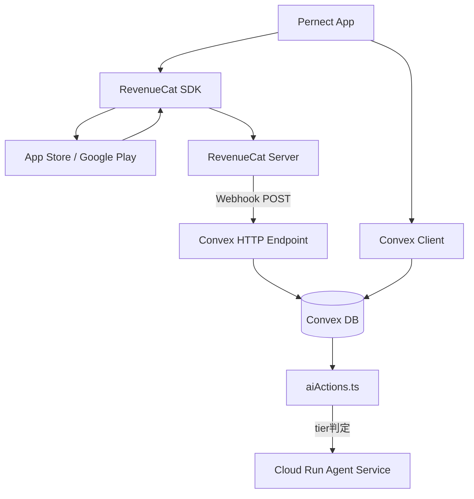
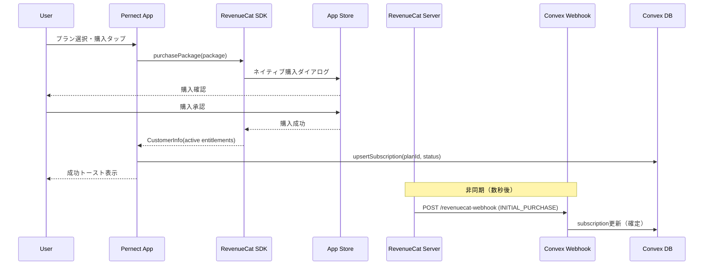
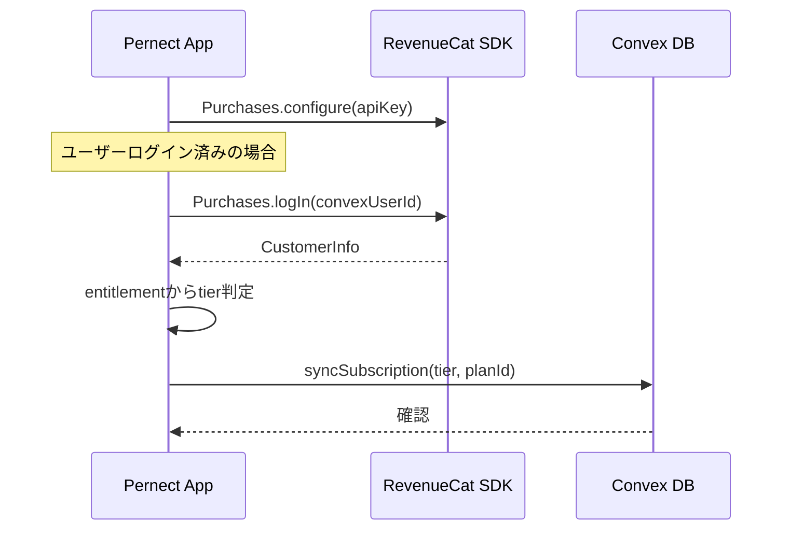
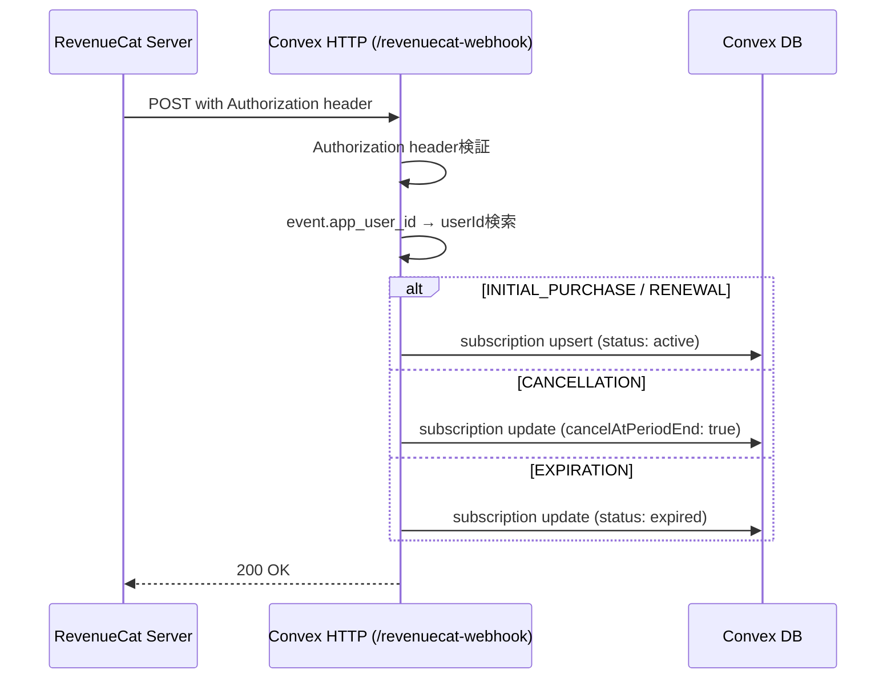
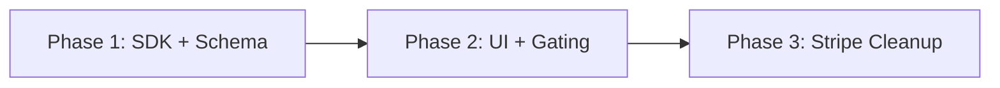

# Technical Design: Premium Subscription (RevenueCat)

## Overview

**Purpose**: RevenueCat SDKを使用してiOS/Android向けアプリ内課金を実装し、Plus/Pro/Maxの3段階サブスクリプションプランでAI分析機能を収益化する。

**Users**: 全Pernectユーザー。無料ユーザーはアップグレード誘導を受け、有料ユーザーはtierに応じたAI分析機能にアクセスする。

**Impact**: 既存のStripe前提のsubscriptionsスキーマとUI画面をRevenueCatベースに移行。`aiActions.ts`の`getTierFromPlanId()`との互換性を維持。

### Goals
- RevenueCat SDKによるネイティブ課金フローの完全実装
- Webhook経由のサーバーサイド状態同期
- 既存tier判定ロジックとの完全互換
- Expo managed workflow + dev client対応

### Non-Goals
- Web課金（RevenueCat Web Billing）は対象外
- プロモーションオファー、無料トライアルは初期リリースでは対象外
- RevenueCat Charts/Analyticsダッシュボード連携

## Architecture

### High-Level Architecture



### Technology Alignment

既存スタックに追加する依存:
- `react-native-purchases` — RevenueCat React Native SDK
- `expo-dev-client` — ネイティブモジュール対応（既存のEASビルドに含まれる可能性あり）

既存パターンとの整合:
- **Context Provider**: `ActionMenuContext`パターンに倣い`SubscriptionContext`を作成
- **Convex queries/mutations**: 既存の`subscriptions.ts`を拡張
- **Expo Router**: `app/settings/subscription.tsx`として新ルート追加
- **features/構造**: `features/premium/`ディレクトリに配置（既存）

### Key Design Decisions

#### Decision 1: クライアント側entitlement判定 + Webhook同期の二重構成

- **Context**: サブスクリプション状態の判定を迅速かつ正確に行う必要がある
- **Alternatives**: (A) Convex DBのみ参照, (B) RevenueCat SDKのみ参照, (C) 二重構成
- **Selected Approach**: (C) クライアント側ではRevenueCat SDK（`CustomerInfo.entitlements`）で即時判定し、サーバー側ではWebhookでConvex DBを更新。Convex側のtier判定（`aiActions.ts`）はDB参照。
- **Rationale**: クライアント側はネットワーク遅延なしで即時UI反映、サーバー側はWebhookで確実に同期されDBがSource of Truth
- **Trade-offs**: 一時的な不整合の可能性（数秒）はあるが、Webhookで最終的に整合する

#### Decision 2: Convex httpActionによるWebhookエンドポイント

- **Context**: RevenueCatからのWebhookを受信する必要がある
- **Alternatives**: (A) Cloud Run経由でConvex mutation呼出, (B) Convex httpAction直接
- **Selected Approach**: (B) `convex/http.ts`にhttpActionを定義し、RevenueCatから直接POSTを受信
- **Rationale**: 追加インフラ不要、Convex DBに直接アクセスできる、低レイテンシ
- **Trade-offs**: Convex httpActionの実行時間制限（10秒）に注意が必要だが、Webhookハンドラーは軽量な更新のみなので問題なし

#### Decision 3: planIdマッピングの維持

- **Context**: 既存の`getTierFromPlanId()`は`plus_monthly`, `pro_yearly`等のprefix判定に依存
- **Selected Approach**: RevenueCatのproduct_idをそのまま`planId`として保存するのではなく、RevenueCat product_idからConvex planIdへのマッピングテーブルを使用
- **Rationale**: App Store/Google Playのproduct_id命名規則に依存せず、既存ロジックとの完全互換を保証

## System Flows

### 購入フロー



### アプリ起動・復帰フロー



### Webhook同期フロー



## Components and Interfaces

### Client Layer

#### SubscriptionProvider (React Context)

**Responsibility**: RevenueCat SDKの初期化、entitlement状態の管理、購入API提供

**Dependencies**:
- **Inbound**: 全画面コンポーネント（`useSubscription()`フック経由）
- **Outbound**: RevenueCat SDK, Convex mutations
- **External**: RevenueCat API (react-native-purchases)

**Contract Definition**:

```typescript
interface SubscriptionContextType {
  // 状態
  tier: "free" | "plus" | "pro" | "max";
  isLoading: boolean;
  customerInfo: CustomerInfo | null;

  // 購入操作
  purchase: (packageToPurchase: PurchasesPackage) => Promise<void>;
  restorePurchases: () => Promise<void>;

  // Offerings
  offerings: PurchasesOfferings | null;
}
```

**State Management**:
- RevenueCat SDKの`CustomerInfo`をソースとしてtierを導出
- `addCustomerInfoUpdateListener`で自動更新
- Convex DBへの同期は購入成功時・アプリ復帰時に実行

#### useUpgradePrompt (Custom Hook)

**Responsibility**: 機能ゲーティングとアップグレード誘導モーダルの表示制御

```typescript
interface UpgradePromptHook {
  // 指定tierが必要な機能をガードする
  requireTier: (
    requiredTier: "plus" | "pro" | "max",
    featureLabel: string
  ) => boolean; // true = アクセス許可, false = モーダル表示

  // モーダル状態
  isModalVisible: boolean;
  modalFeatureLabel: string;
  requiredTier: string;
  dismissModal: () => void;
}
```

### Screen Layer

#### PaywallScreen (`features/premium/screens/PaywallScreen.tsx`)

**Responsibility**: プラン比較・購入画面。既存の`PlanSelectionScreen`を置き換え。

**Contract**:
```typescript
interface PaywallScreenProps {
  onBack: () => void;
  onSuccess?: () => void;
  highlightTier?: "plus" | "pro" | "max";
}
```

**Key Changes from existing PlanSelectionScreen**:
- `useQuery(api.subscriptions.listPlans)` → `useSubscription().offerings`からパッケージ取得
- `handleSubscribe` → `useSubscription().purchase(package)`呼出し
- 価格表示: ストアのローカライズ価格（`package.product.priceString`）を使用

#### SubscriptionManageScreen (`features/premium/screens/SubscriptionManageScreen.tsx`)

**Responsibility**: 現在のサブスクリプション管理。既存の`SubscriptionManagementScreen`を置き換え。

**Key Changes**:
- キャンセル: ストアのサブスクリプション管理画面へ遷移（`Linking.openURL`）
- 現在プラン: `useSubscription().customerInfo`から取得
- 次回更新日: `customerInfo.latestExpirationDate`

#### UpgradeModal (`features/premium/components/UpgradeModal.tsx`)

**Responsibility**: 機能制限時のアップグレード誘導モーダル

```typescript
interface UpgradeModalProps {
  visible: boolean;
  onDismiss: () => void;
  featureLabel: string;
  requiredTier: "plus" | "pro" | "max";
  onViewPlans: () => void;
}
```

### Backend Layer

#### Convex HTTP Endpoint (`convex/http.ts`)

**Responsibility**: RevenueCat Webhookの受信・処理

```typescript
// POST /revenuecat-webhook
interface WebhookHandler {
  // リクエスト検証
  validateAuthorization(authHeader: string): boolean;

  // イベントハンドリング
  handleEvent(event: RevenueCatEvent): Promise<Response>;
}

interface RevenueCatEvent {
  type: WebhookEventType;
  app_user_id: string;
  product_id: string;
  entitlement_ids: string[];
  expiration_at_ms: number | null;
  purchased_at_ms: number;
  environment: "PRODUCTION" | "SANDBOX";
  price: number;
  currency: string;
}

type WebhookEventType =
  | "INITIAL_PURCHASE"
  | "RENEWAL"
  | "CANCELLATION"
  | "UNCANCELLATION"
  | "EXPIRATION"
  | "BILLING_ISSUE"
  | "PRODUCT_CHANGE"
  | "TEST";
```

#### subscriptions.ts (Convex mutations — 拡張)

**Responsibility**: サブスクリプションCRUDの更新

```typescript
// クライアント側同期用
interface SyncSubscriptionArgs {
  planId: string;
  status: "active" | "cancelled" | "expired";
  revenuecatId: string;
  currentPeriodEnd: number | undefined;
}

// Webhook用（internal mutation）
interface WebhookUpdateArgs {
  revenuecatAppUserId: string;
  eventType: string;
  productId: string;
  expirationAtMs: number | undefined;
  purchasedAtMs: number;
}
```

### Configuration Layer

#### RevenueCat Product → planId マッピング

```typescript
// lib/subscription-config.ts
const REVENUECAT_PRODUCT_MAP: Record<string, string> = {
  // iOS product IDs → Convex planIds
  "pernect_plus_monthly": "plus_monthly",
  "pernect_plus_yearly": "plus_yearly",
  "pernect_pro_monthly": "pro_monthly",
  "pernect_pro_yearly": "pro_yearly",
  "pernect_max_monthly": "max_monthly",
  "pernect_max_yearly": "max_yearly",
};

// Entitlement → tier マッピング
const ENTITLEMENT_TIER_MAP: Record<string, string> = {
  "plus": "plus",
  "pro": "pro",
  "max": "max",
};
```

## Data Models

### Convex Schema Changes

#### subscriptions テーブル（変更）

```
subscriptions {
  userId: Id<"users">
  planId: string              // "plus_monthly", "pro_yearly" etc. (既存互換)
  status: string              // "active" | "cancelled" | "expired" | "billing_issue"
  startDate: number
  endDate: optional(number)
  cancelAtPeriodEnd: optional(boolean)
  // ---- Stripe fields → 削除 ----
  // stripeSubscriptionId: 削除
  // stripeCustomerId: 削除
  // ---- RevenueCat fields → 追加 ----
  revenuecatAppUserId: optional(string)    // RevenueCat app_user_id
  revenuecatProductId: optional(string)    // ストアのproduct_id
  revenuecatEntitlementId: optional(string) // entitlement識別子
  currentPeriodStart: optional(number)
  currentPeriodEnd: optional(number)
  createdAt: number
  updatedAt: optional(number)
}
Index変更:
  - 削除: by_stripeCustomerId
  - 追加: by_revenuecatAppUserId ["revenuecatAppUserId"]
  - 維持: by_user, by_status, by_user_status
```

#### subscriptionPlans テーブル（変更）

```
subscriptionPlans {
  planId: string
  name: string
  description: string
  billingPeriod: string
  price: number
  currency: string
  features: array(string)
  isActive: boolean
  sortOrder: number
  // ---- 変更 ----
  // stripePriceId → 削除
  revenuecatProductId: optional(string)    // RevenueCat product identifier
  revenuecatEntitlementId: optional(string) // 対応するentitlement
  createdAt: optional(number)
}
```

### RevenueCat Configuration (ダッシュボード側)

#### Entitlements
| Entitlement ID | 説明 |
|---|---|
| `plus` | Plus tier機能アクセス |
| `pro` | Pro tier機能アクセス（Plusを含む） |
| `max` | Max tier機能アクセス（Pro/Plusを含む） |

#### Products (App Store Connect / Google Play Console)
| Product ID | Entitlement | 価格 |
|---|---|---|
| `pernect_plus_monthly` | plus | ¥480/月 |
| `pernect_plus_yearly` | plus | ¥4,800/年 |
| `pernect_pro_monthly` | pro | ¥980/月 |
| `pernect_pro_yearly` | pro | ¥9,800/年 |
| `pernect_max_monthly` | max | ¥1,980/月 |
| `pernect_max_yearly` | max | ¥19,800/年 |

#### Offerings
| Offering ID | パッケージ |
|---|---|
| `default` | 上記6プロダクト全て |

## Error Handling

### Error Categories

**購入エラー（クライアント側）**:
| エラー | 原因 | 対応 |
|---|---|---|
| `PURCHASE_CANCELLED_ERROR` | ユーザーキャンセル | 何も表示しない |
| `STORE_PROBLEM_ERROR` | ストア側障害 | リトライ促すトースト |
| `NETWORK_ERROR` | 通信エラー | オフラインメッセージ |
| `PURCHASE_NOT_ALLOWED_ERROR` | 端末制限 | 説明メッセージ |
| `PRODUCT_ALREADY_PURCHASED_ERROR` | 重複購入 | 「既に加入済み」表示 |

**Webhook エラー（サーバー側）**:
| エラー | 対応 |
|---|---|
| Authorization header不一致 | 401返却、ログ記録 |
| ユーザー未発見 | 200返却（リトライ防止）、ログ記録 |
| DB更新失敗 | 500返却（RevenueCatがリトライ） |

### Monitoring
- Convex DashboardでhttpActionのエラーログ監視
- RevenueCat DashboardでWebhookの成功/失敗率確認

## Testing Strategy

### Unit Tests
- `getTierFromPlanId()` — planId→tier変換のパターン網羅
- `REVENUECAT_PRODUCT_MAP` — product_id→planIdマッピング正確性
- Webhook Authorization header検証ロジック

### Integration Tests
- Webhook受信 → Convex subscription更新の一連フロー
- `INITIAL_PURCHASE` → `RENEWAL` → `CANCELLATION` → `EXPIRATION` のライフサイクル
- アプリ復帰時のRevenueCat→Convex同期

### E2E Tests（Sandbox環境）
- プラン選択 → 購入完了 → 機能解放の全体フロー
- 購入復元フロー
- アップグレード誘導モーダル → プラン選択 → 購入

### Manual Tests
- RevenueCat Sandbox環境でのiOS/Android購入テスト
- Webhook TESTイベントでのエンドポイント検証
- オフライン → オンライン復帰時のentitlement同期

## Security Considerations

- **Webhook認証**: RevenueCat Dashboard設定のAuthorization headerをConvex環境変数に保存し、全リクエストで検証
- **サーバーサイド信頼性**: AI分析のtier判定はConvex DB（Webhookで更新済み）を参照。クライアント側entitlementはUI表示用のみで、実際のアクセス制御はサーバーサイドで実施
- **環境分離**: `environment`フィールド（`PRODUCTION`/`SANDBOX`）を確認し、本番ではSANDBOXイベントを無視

## Migration Strategy

### Phase 1: SDK統合・新スキーマ（破壊的変更なし）
1. `react-native-purchases`インストール、`SubscriptionProvider`実装
2. `convex/schema.ts`にRevenueCatフィールド追加（Stripeフィールドは残す）
3. `convex/http.ts` Webhookエンドポイント作成
4. PaywallScreen, SubscriptionManageScreen実装

### Phase 2: UI統合・機能ゲーティング
1. 設定画面にサブスクリプション管理導線追加
2. UpgradeModal実装、AI分析画面に統合
3. 購入復元ボタン追加

### Phase 3: Stripeフィールド削除（クリーンアップ）
1. `stripeSubscriptionId`, `stripeCustomerId`, `stripePriceId`をスキーマから削除
2. `by_stripeCustomerId`インデックス削除
3. `subscriptions.ts`のStripe Webhook handler削除


